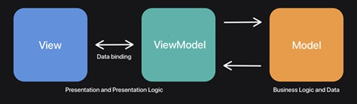
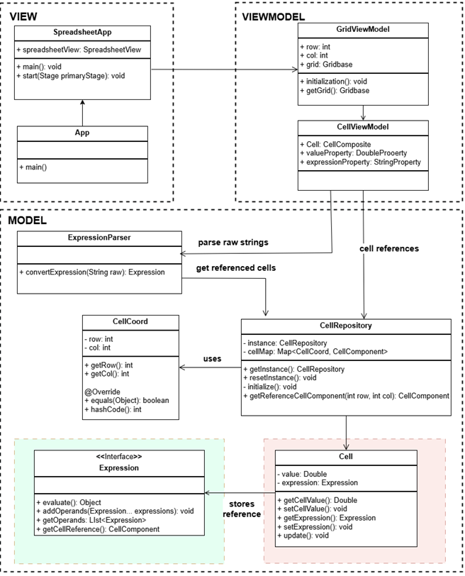

# CS 4233 - Term Project  - Summer E Term 
___
### Context
___
We've all seen spreadsheets before: grids of cells with either blanks, values, or expressions that evaluate some function over inputs from other cells and/or constants. 
Fancier spreadsheets can include graphs, images, formatted text, etc. — but we don’t need to consider such details right now.

Spreadsheets are actually a fairly sophisticated functional programming environment: expressions can contain functions of a fixed number of arguments, or of a range of values; they can contain conditionals to select among options, etc. 
Moreover, if we edit any of the cells, every cell that depends upon it will automatically get re-evaluated to incorporate the new input value. (This is a small example of what is known as dataflow programming, and it’s a very powerful and useful programming model.)

In the term project, we will build a simple spreadsheet application using Java and JavaFX. We will practice the use of design patterns to organize our code according to object oriented design principles and make our code flexible, easy to read and maintain. 

___
## Spreadsheet Basics:
___
### Cell references:
* In a spreadsheet, cell names are written as `<column name><row index>`, where column names follow the pattern:
  * Columns 1 through 26 get names A through Z, columns 27 through 52 get names AA through AZ, columns 53 through 78 get names BA through BZ ...etc.
  * Row indices are also numbered starting from 1. In this naming scheme, there is no row or column with index 0.
* Spreadsheet cells can be referred individually (e.g. A1, C10, F12, etc.) or as a “cell group” (e.g., A1:C3) which corresponds to a collection of cells on the spreadsheet. 
  * A cell group specifies the top left and bottom right corner of the cell collection on the spreadsheet.  For example, “A1:C3” refers to the cell group including A1, A2, A3, B1, B2, B3, C1, C2, C3.
* In the starter code we have provided the `CellCoord` class for you to describe cell coordinates in a spreadsheet.
  
### Cell Contents:
* An individual spreadsheet cell may:
  * be blank 
  * contain a constant  value 
  * contain a formula which evaluates to a value. 
  
* To keep it simple, we will assume that our spreadsheet cells can have only “double” values. 
* The starter code provides the `Cell` class, representing a cell in the spreadsheet. `Cell` class has private attributes “`value`” and “`expression`” storing the value and expression of a cell. We will explain the expressions further in [Starter Code section](#starter-code) :
  * if the cell content is blank, its value is assumed to be `0.0`; 
  * if the cell content is a constant, its value stores the constant double value and its expression will be `null`. 
  * If the cell content is a formula, then its `expression` attribute will store the parsed formula (i.e. `Expression`)  and the `value` attribute will store the value it evaluates to. 
    * A formula typically starts with `'='` character. It may either involve a constant value (e.g. `“=9”`) or an arithmetic formula containing one or more functions (operators) applied to constant values or references to other cells.
    * A formula that involves a constant just evaluate to that constant value. For example: `“=9”` evaluates to `9.0`.
    * A formula that involves operators and/or cell references will require evaluation of the operators on the provided operands.   
      * For example: `"=AVE(B1:B3, SUM(A1:A4)*2, 10+40/8*2)"`
          * The above formula will evaluate to `20.0` (the average of the values in cells `B1`, `B2`, `B3`, "sum of `A1`,`A2`,`A3`, and `A4`”, and the expression `“10+40/8*2”`)
          * No formula is permitted to refer to itself, though, either directly or indirectly, since that would lead to an infinite regress.

### Operators
Your spreadsheet should support the following operators: 
#### 1. Arithmetic operators : 
*  `*` , `/`, `+`, `-` (assume PEMDAS for precedence, i.e.,  Parentheses, Multiplication and Division, and Addition and Subtraction (from left to right)).
#### 2. Aggregate operators : 
* Aggregate operators can have any number of arguments including constants, cell references, and cell group references.  We will support the aggregate functions SUM, COUNT, and AVE:
  * `SUM` : calculates sum of the values of its arguments. Examples:
    * `SUM(10)` evaluates to `10` 
    * `SUM(10,5*4)` evaluates to `30` 
    * `SUM(A1,A2)` evaluates to `A1+A2` 
    * `SUM(A1:B3)` evaluates to `A1+A2+A3+B1+B2+B3` 
    * `SUM(A1:B2, A4, 40/2)` evaluates to `A1+A2+B1+B2+A4+20.0`
  
  * `COUNT` : calculates the number of  cells and values passed to it. Examples:
    * `COUNT(10)` evaluates to 1
    * `COUNT (10,5*4)` evaluates to 2 
    * `COUNT (A1,A2)` evaluates to 2 
    * `COUNT (A1:B3)` evaluates to 6 
    * `COUNT (A1:B2, A4, B2:B4,10)` evaluates to 9

  * `AVE`: calculates the average of the values of its arguments. Examples:
    * `AVE(10)` evaluates to `1`
    * `AVE(10,5*4)` evaluates to `10`
    * `AVE(A1,A2)` evaluates to `(A1+A2)/2`
    * `AVE(A1:B3)` evaluates to `(A1+A2+A3+B1+B2+B3)/6`
    * `AVE(A1:B2, A4, 40/2)` evaluates to `(A1+A2+B1+B2+A4+20.0)/6`

## Spreadsheet Application 
We will build this application progressively using the Model-View-ViewModel architectural pattern which separates the application's logic from its user interface, enhancing maintainability and testability. 
It consists of three main components: the Model, View, and ViewModel. 
* **Model**: Manages data access (grid and cells) and encapsulates the logic for processing expressions 
* **View**: Represents the user interface (spreadsheet), displaying data and providing interaction.
* **ViewModel**: Acts as an intermediary, transforming data from the Model and providing it to the View ([CellViewModel](#viewmodel-) and [GridViewModel](#viewmodel-)).

<kbd>

</kbd>

The starter code provided already implements the View and the ViewModel  components. Please see the [section "Starter Code"](#starter-code) for more details. 
In the term project, we will  mostly work on the model which involves the implementation of:
* cells and cell groups, 
* expressions, operators, operands (constants and cell references) 
* parsing formulas and converting them to expressions
* evaluating expressions
* connecting Model to the ViewModel.

You will start with the given code and complete the implementation of the Model. You will use several design patterns and make sure that your code is organized according to OOP design principles. 
The milestone descriptions will specify the mandatory design patterns you should use; however, you should try to adopt additional design patterns to improve the organization of your code.  
___
## Starter code:
___
The starter code provides the IntelliJ Maven project where all dependencies including required JavaFX libraries are already added to the project configuration (pom.xml file). If you are not familiar with Maven projects, please refer to IntelliJ Maven documentation. 

Please refer to the "Term Project Overview" video for a walkthrough of the starter code and instructions on how to set it up and run it. 
If you edit the `pom.xml` file and edit/add any of the dependencies, don't forget to **"sync"** and **"refresh"** the maven project.  

As explained in the previous section, the starter code is organized according to MVVM architectural pattern. The UML class diagram for the starter code is given below:

<kbd>

</kbd>

### View: 
The application uses the  ControlFX Library (from JavaFX)  for the user interface. It uses the “SpreadsheetView” component of ControlFX for the interactive grid on the user interface. In`SpreadsheetApp.java` file, it creates the `Scene` and the `Stage` objects for the JavaFX user interface and initializes and adds the Spreasheet object. 
The basic view implementation of the application is complete and you don’t need to make any changes to the `App.java` and `SpreadsheetApp.java` files. Any major improvements to the view will be considered for extra credit. 

### ViewModel: 
Acts and an intermediary between the Model and the View. It encapsulates the presentation logic, expose observable properties for data binding, and handle user commands in a way that decouples the View from the Model. 
The ViewModel implementation is mostly complete.  The starer code provides the `GridViewModel` and `CellViewModel` classes. 

`CellViewModel` binds a cell in the `CellRepository` to a cell in the `SpreadsheetView` grid on the UI. It acts as a medium for the `SpreadsheetCell` of the View, and the `Cell` of the Model. 
- The `CellViewModel` stores JavaFX data called `Property` (Double and String, representing cell value and expression in string literal respectively).
- These Properties are live-data that updates the UI if the value stored inside these properties change.
- It listens to changes (user inputs) on the UI and updates the `Cell` accordingly
- The `CellViewModel` stores flags to prevent race conditions and unnecessary cascading (used in GridViewModel)

And the `GridViewModel` is responsible for initializing the grid to be used by the `SpreadsheetView`. It creates all `CellViewModel` instances for all grid cells and configures them.  

The `GridViewModel` loosely connects `CellViewModel` with `SpreadsheetCell` by binding the `CellViewModel`'s property bi-directionally with the `SpreadsheetCell`'s `Property` (this property is the actual text on the spreadsheet UI)
- Everytime the `SpreadsheetCell`'s `Property` get updated by user inputs, it parses the expression to the referenced `Cell` in the `CellViewModel`
- Everytime the `CellViewModel` has its `Cell`'s value updated, it updates the `SpreadsheetCell`'s Property to display the new value
- Only one of those two events can be happening at a time, so we store flags inside the `CellViewModel` to prevent the unnecessary cascades.
  + For example, if the user input (through `SpreadsheetCell`'s `Property`) triggers the `Cell` to update its value, which in turns triggers the `SpreadsheetCell`'s `Property` to re-update again, it can cause the data to continuously loop.


The ViewModel implementation is mostly complete, however, in milestone 2 you will need to update `GridViewModel` after you unify the interface for cells and cell groups. To make types compatible for various methods, you may need to revise the types for the cell variables. 

### Model: 
The model manages the data access (grid and cells) and encapsulates the logic for processing expressions. In the starter code, the model includes the following classes:

#### Expression Parser

The `ExpressionParser` class provides the static methods for parsing the formula inputs and converting them to `Expression` objects. It uses the **[Shunting Yard Algorithm](https://mathcenter.oxford.emory.edu/site/cs171/shuntingYardAlgorithm/)** for converting the expression from infix notation to postfix notation.
Postfix notation is useful because it allows the expression to compute directly from left to right instead of considering PEMDAS and parenthesis.
```
    Infix notation:   (3 + A1) * 20   < Humans like to evaluate this
    Postfix notation: 3 A1 + 20 *     < Computers like to evaluate this
```
The postfix notation is used to create the Expression Tree (your implementation of `Expression`).

The base shunting yard algorithm allows **Arithmetics functions** (i.e add, subtract, minus, divide), and **Constants**.
We modify the algorithm to also consider variables such as **cell reference, cell group reference, and aggregate functions** (i.e SUM, COUNT, AVE).

The flow of the logic includes:
- **Step 1**: Tokenize the string expression to an array of tokens (i.e "A1", "1", "+", "SUM" are tokens). 
  - *<--- Already implemented.* See the `tokenize` method in  `ExpressionParser.java`. 
- **Step 2**: Convert the array of tokens from infix notation to postfix notation.  
  - *<--- Already implemented.* See the `infixToPostfix` method in  `ExpressionParser.java`
- **Step 3**: Convert the array of tokens from postfix notation into an expression tree.  
  - *<--- You will work on this in milestones 1 and 2.* See the `postfixToExpression` method in  `ExpressionParser.java` 
  - For a high-level description, read the comments in `ExpressionParser.java`


#### Cell Repository
CellRepository is set to static 20 columns and 100 rows.
CellRepository stores the data for the spreadsheet. It acts as a central data point between the View and the Model. It maps each Cell to a unique `CellCoord` representing the coordinate of the cell in the grid. 
The definition of `CellCoord` class is provided in the starter code.
  * Note that `CellCoord` starts at column 0 and row 0, which is different from the basic cell naming convention.
      * For example,
        * Cell `A1` is at `CellCoord` row 0 and column 0.Add commentMore actions
        * Cell `AA1` is at `CellCoord` row 0 and column 26.
        * Cell `B2` is at `CellCoord` row 1 and column 1.
    
Cell repository adopts the “Singleton" design pattern. This design allows a single instance of spreadsheet data, meaning `CellRepository` will only get initialized once and stay consistent across all structure levels.
CellRepository can be used as follows:

  Option 1:
  ```java
  CellRepository repo = CellRepository.getInstance();
  repo.getReferenceCellComponent(row, col);
  ```
  Option 2:
  ```java
  CellRepository.getInstance().getReferencedCellComponent(row, col);
  ```

#### Cell 
Cell represents a single cell in the spreadsheet. 
* Each Cell has a value (initially assumed to be `0.0`). 
* Cell holds a reference of its expression, and can be used to re/evaluate and store in value. 
  * If the cell is assigned a constant value, its expression will be `null`. 
  * Otherwise, if the cell is assigned a formula (e.g. `"=10+A2"`), then the formula will be parsed and converted to an `Expression` object. The `expression` attribute  will hold a reference to that object and the value it evaluates to will be assigned to `value`. 
 
In milestone 2, you will define a class to represent “ cell groups” and you will unify the cell and cell group interfaces by applying composite pattern. 

#### Expression
The starter code provides the interface for `Expression`. You will implement this interface to create your own expression tree for evaluating expressions. 

As explained above, when the user enters a formula in a spreadsheet cell, it will be parsed and converted to an `Expression`. 
Since the formulas may have nested calls to operators, the best way to represent it will be an expression tree. 
You can design your expression structure as you want; however, it should be flexible and easy to extend, i.e., it should be easy to add new operators without major modifications to your code. 
You should adopt design patterns and functional programming practices to make your code flexible. We suggest you to adopt "Composite" pattern to unify the interface for operators and operands. 

Your implementation of the `Expression` interface should implement the `evaluate()` method.  `evaluate` should evaluate the expression and return the result as a double. 

You will work on this part during the first two milestones:
1. In milestone1, you will evaluate expressions where all operands are constants and you will only support arithmetic operators (i.e., +,-,*,/). (For example : `"=5+4*(2+100/(10-2))"`) 
2. In milestone2, you will support cell and cell group references. (For example : `"=60+B2+AVE(A1:A2, 10, B2)*SUM(5,6)"`) 
   * This will require you allow cell and cell group references as operands in the expression tree.

## Summary of the milestones:
### Milestone1:
* Make sure that you can compile and run the given starter code. Spend some time to review and understand the given code; go back and forth between this document and starter code.
* Implement the expression tree representing the expressions. Your expression tree should implement the interface `Expression` provided in the starter code. 
  * Your expression tree should support the arithmetic operators +, -, *, / (i.e., addition, subtraction, multiplication, and division). The operations can be nested. You will add support for aggregate operators (SUM, COUNT, and AVE) in milestone 2.
  * You should implement the `evalaute()` method of the `Expression`; `evaluate` should evaluate the expression and return the result as a double.
  * You can assume that all operands are constants (For example : `"=5+4*(2+100/(10-2))"`) You will add support for cell and cell group references in milestone2. 
  * Your expression tree structure should comply with OO design principles we discussed in class. You should adopt appropriate design patterns as necessary. I suggest you to use "Composite" pattern to unify the interface for operator and operand. 
  * When you revise your expression tree implementation in milestone2, it should not require major revision of your expression tree.  You should be able to add support for cell and cell group references with minor changes. In other worlds, your implementation should be "open for extension but closed for modification".
  * You should write JUnit tests, testing your implementation of `evaluate()` method. 
    * See the milestone description for the complete list of tests you should write.  

*  In `ExpressionParser` class, complete the `postfixToExpression()` method to convert the user entered formulas to `Expression`s.
    * In milestone 1, we will initially work on formula inputs that involve arithmetic operators and constants only. In milestone2 , you will add support for aggregate operators and cell/cell group  references.
    * A detailed pseudocode for the parser algorithm is provides in the `ExpressionParser.java` file.
    * You should write JUnit tests, testing your `postfixToExpression()` method. 
      * See the milestone description for the complete list of tests you should write.  


### Milestone2:
* The given starter code defines the `Cell` class representing a cell in the grid. Since the expression operands may be either individual cells (e.g. B1) or cell groups (e.g., A1:B2), there is a need to create a uniform interface for cells and cell groups.
  * Use "Composite" pattern to create a unified interface for cells and cell groups.
    * Update the `CellRepository`, `CellViewModel` and `GridViewModel` classes to use this common interface instead of the `Cell` class.
    * In milestone 2, you will link the `Expression` with the cell interface to support cell references in expressions.
* Revise your  `postfixToExpression()` method in `ExpressionParser` to support cell and cell group references in formulas. 
* Extend your expression tree implementation. Try to add the following requirements by extending your implementation through subclassing and composition (or aggregation) rather than modification. 
  * Add support for aggregate operators (SUM, COUNT, and AVE) 
  * Add support for cell and cell group references in expressions. 
  * You should write JUnit tests, testing your implementation of `evaluate()` method. The formulas you evaluate should involve cell and group cell references.
    * See the milestone description for the complete list of tests you should write.  


### Milestone3:
In milestone3, you will make sure that everything works together and have a working spreadsheet application. In addition, you will work on the the following tasks:
* Add an observer for cell and cell group. When the value of a cell is updated, the observer should notify all other cells whose expressions refer to that cell. Of course, you will use te Observer pattern to implement this. 
* Extend your parser and expression implementation and add support for two additional aggregate operators.
* Use strategy pattern to customize the algorithms used for evaluating these operators. 
* See the milestone description for the complete list of tests you should write.  

